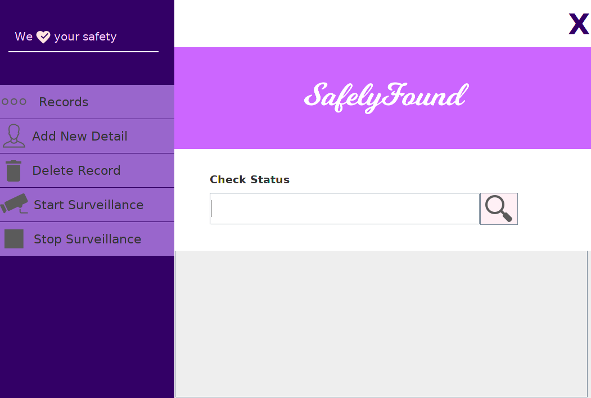
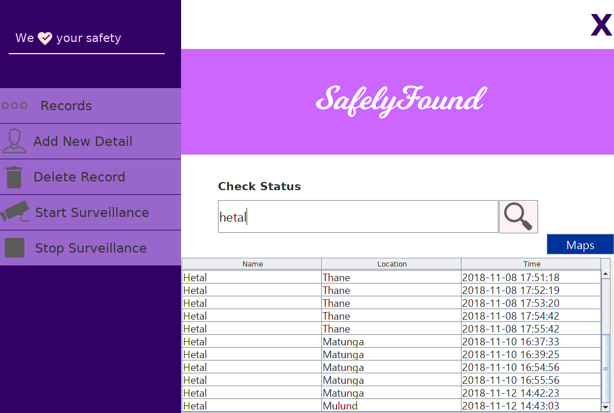
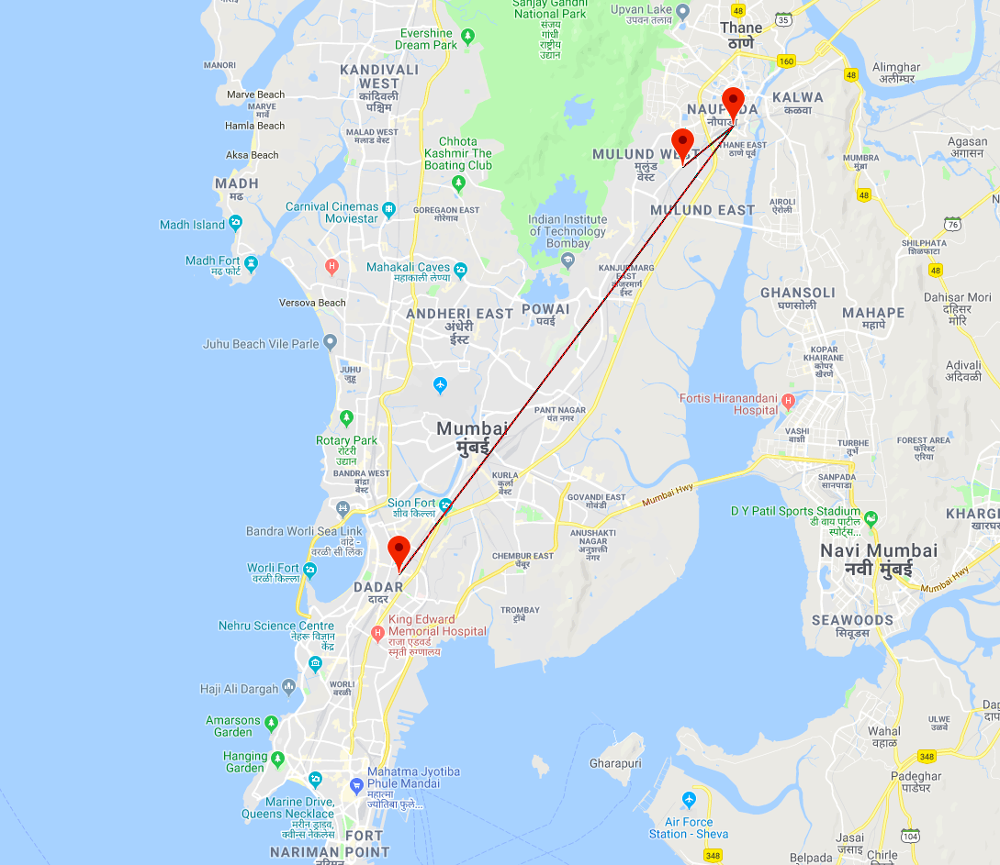
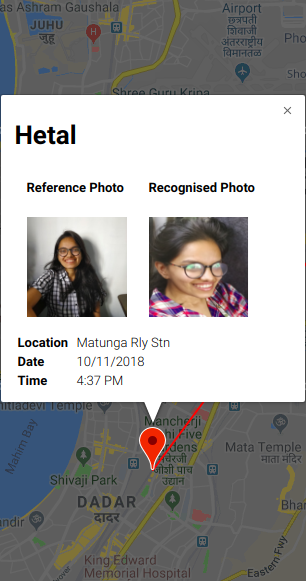

  

<h3 align="center">Providing help to locate missing children via face recognition</h3>

------------------------------------------

> **174**. That is the average number of children that go missing every day in India. 2 out of 3 missing children are untraced in a period of three years and about half are never found. The wait for them is an excrutiaing see-saw of agony and hope for their loved ones.

> For our OOPM Project, we have made an application that uses facial recognition to help locate missing children in India.

------------------------------------------
### Screenshots

  

  

  

-----------------------------------------

### Features:

- [x] Face Recognition to identify missing people when they come in sight of the camera
- [x] Google Maps pins to visualize the path of the missing person for accurate respone.
- [x] Option to send an automatic email notification to the family upon successful rescue.  
- [x] Ability to make multiple systems scan multiple streams at multiple locations parallelly, all synced with the same data.

------------------------------------------
### Add-Ons

- [ ] Expansion beyond just Railway stations
- [ ] Realtime notification system for regional authorities.
- [ ] Path prediction

------------------------------------------

### Note

- This repository was part of our OOPM Project

------------------------------------------
### Contributors

- [@akshay-99](https://github.com/akshay-99)
- [@hetzz](https://github.com/hetzz)
- [@yashmody12](https://github.com/yashmody12)
